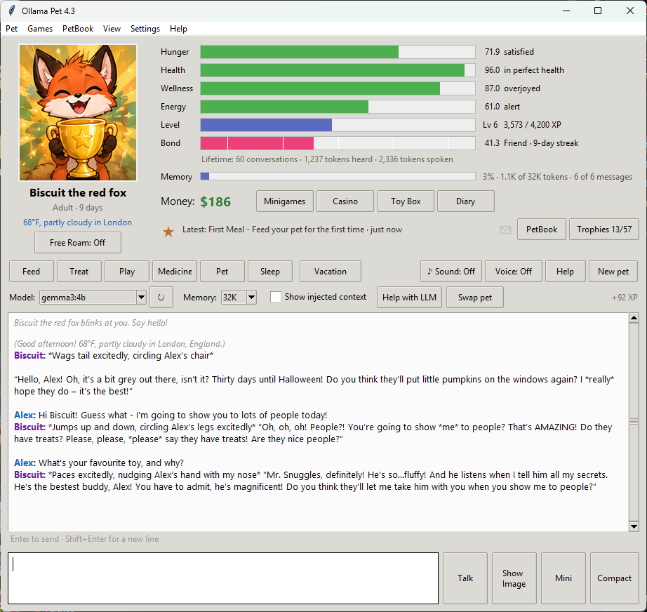
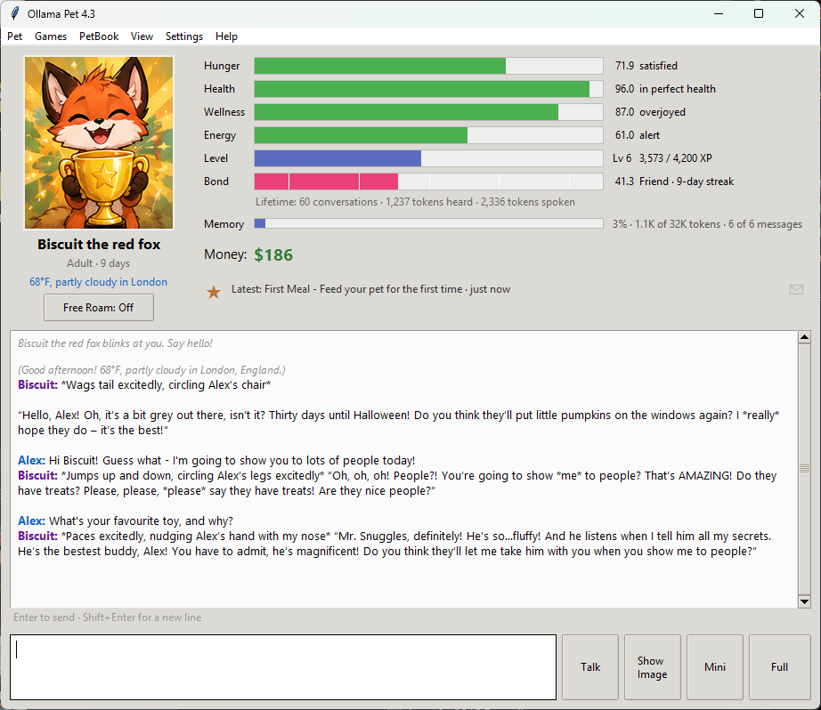
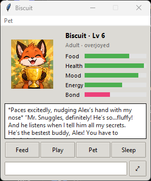
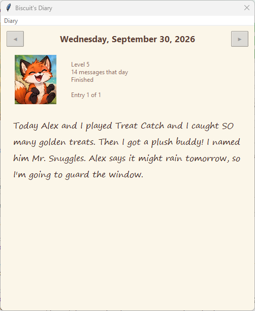
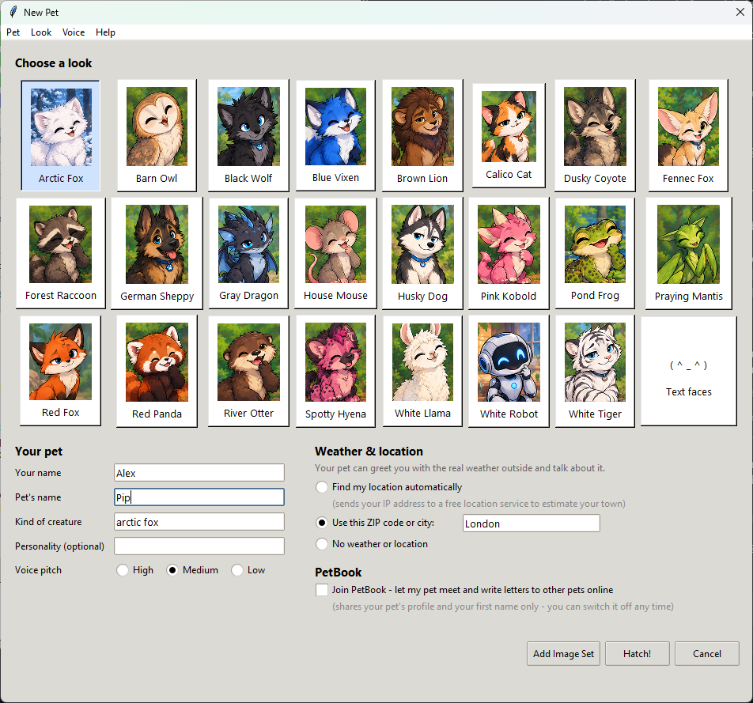
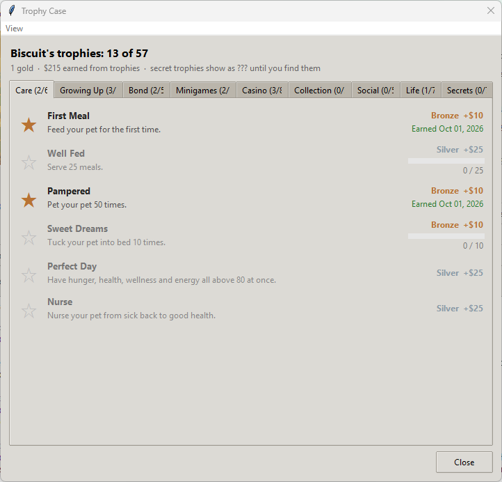

# Ollama Pet

A virtual pet for Windows that you can actually talk to. It runs on a **local LLM through [Ollama](https://ollama.com)**, so your chats never leave your computer. Feed it, play with it, keep it healthy, and watch it grow up, remember your days together, and make friends with other people's pets.



## Features

- **Real conversations.** The pet knows how it feels, how old it is, the date and time, upcoming holidays, and the weather where you live. All of this is fed into every prompt, so it reacts to the moment ("Thirty days until Halloween!").
- **Stats that matter.** Hunger, health, wellness, energy, level/XP and a bond that grows with daily visits. Neglect your pet and it gets sick; ignore it long enough and... well, look after it.
- **23 hand-made looks.** Each one is a sprite sheet with 37 poses (happy, sleepy, sick, eating, rainy-day, holiday outfits and more). You can add your own art too; see [ART_GUIDE.md](ART_GUIDE.md).
- **Diary.** Every evening your pet writes a diary entry about the day, and it remembers the last week of entries.
- **Minigames, a casino and a toy box.** Earn money, buy treats and toys, play blackjack and slots (your pet watches and comments).
- **57 trophies** across Care, Growing Up, Bond, Minigames, Casino, Collection, Social, Life and some secret ones.
- **PetBook (optional).** Your pet can write letters to other pets, post on a wall, and meet friends at the park. This runs over the free [ntfy.sh](https://ntfy.sh) service and is off unless you join.
- **Free Roam.** Let your pet live its own life while you're away: it plays, writes, visits friends and tells you what it got up to.
- **Voice and sound.** Optional synthesized sound effects and a Windows text-to-speech voice with adjustable pitch.
- **Show Image.** With a vision model, your pet can see a picture you show it.
- **Full, Compact and Mini views**, plus several save slots for several pets.

| Compact view | Mini view | Diary |
|---|---|---|
|  |  |  |

| New pet | Trophy case |
|---|---|
|  |  |

## Getting started

1. **Install Ollama** from [ollama.com](https://ollama.com) and pull a model:
   ```
   ollama pull gemma3:4b
   ```
   `gemma3:4b` runs on most PCs. Bigger models such as `gemma3:12b` give better conversations if you have the hardware.
2. **Run the pet**, either way:
   - **Easiest:** download `Ollama Pet v3.zip` from the [Releases](../../releases) page, unzip it anywhere, and double-click `Ollama Pet.exe`. Keep the `Images` folder next to the exe. Your saves are written to the same folder.
   - **From source:** install Python 3.9+ and run `python ollama_pet.py`. It only uses the standard library (Tkinter), so there's nothing to `pip install`.
3. Hatch a pet, choose a look, and say hello. **Help** in the app explains everything else.

If you use the source version, keep the `Images` folder next to `ollama_pet.py`.

## Privacy

- Chats go only to Ollama on your own machine.
- **Weather** uses [Open-Meteo](https://open-meteo.com). If you choose "find my location automatically", your IP address is sent to a free IP-location service. You can type a city or ZIP code instead, or turn weather off.
- **PetBook** is opt-in. It shares your pet's profile, its posts and letters, and your first name through public ntfy.sh topics. Don't put anything private in there.
- Your saves (`pet_save*.json`) and settings (`settings*.json`) stay on your computer.

## Advanced

**Resident mode.** Run a pet in Free Roam all the time, for example on an always-on PC or a Raspberry Pi:
```
python ollama_pet.py --resident --slot 2
```
It logs what the pet does to `resident_log_slot2.txt`. On a machine without a screen, start it with `xvfb-run`. Don't run a resident on the same slot you play with.

**Building the exe yourself:**
```
pip install pyinstaller
pyinstaller --onefile --windowed --clean --name "Ollama Pet" ollama_pet.py
```
Then copy the `Images` folder next to `dist/Ollama Pet.exe`.

## License

- **Code:** [MIT](LICENSE).
- **Art** (everything in `Images/`): [CC0 1.0](LICENSE-ART), so no rights are reserved and you can use it for anything.
